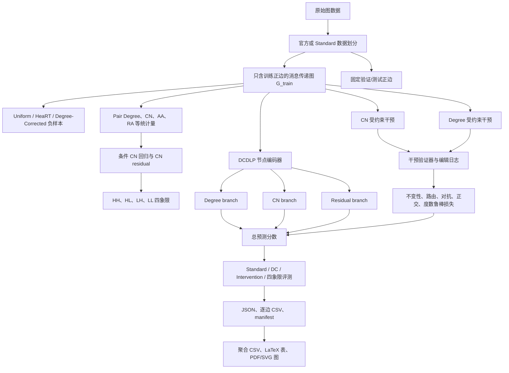

# DCDLP 实验整体逻辑讲解

本文用于解释 DCDLP 工程“为什么做、每个文件夹做什么、各实验想验证什么，以及所有模块如何连成一条完整证据链”。

> 重要说明：当前工程已经完成单元测试和内置小图 smoke test，但尚未完成 Cora、CiteSeer、PubMed、ogbl-collab、ogbl-ddi 上的论文级多种子实验。当前 `results/tables/paper_main.tex` 是流程验收产物，不是可以直接写入论文的五数据集主结果表。

## 1. 这个实验究竟研究什么

链路预测的任务是：给定一张图，判断两个当前没有连边的节点以后是否应该连接。

普通链路预测模型可能通过以下信号做判断：

- 节点度数：连接很多边的热门节点更容易再次被预测为正边；
- 共同邻居：两个节点拥有的共同邻居越多，越可能形成三角闭包；
- 节点属性：例如论文主题、用户兴趣、蛋白质属性；
- 更高阶图结构：例如多跳路径、局部子图形状。

DCDLP 关注的问题不是单纯把 AUC 或 MRR 做高，而是进一步追问：

1. 模型的高分有多少来自“高度节点更容易被预测为正边”这个度数捷径？
2. 在度数保持不变时，模型能否正确响应共同邻居的变化？
3. 在共同邻居保持不变时，改变度数会让模型产生多大波动？
4. 能否将预测证据拆成度数机制、共同邻居机制和剩余结构机制？
5. 这种拆分能否提高困难负样本、度数校正负样本和分布变化下的鲁棒性？

因此，整个项目不是一个普通的“三分支网络实验”，而是四层证据链：

1. **诊断偏差**：先证明标准链路预测中确实存在 degree/CN 偏差；
2. **控制变量**：构造合法结构干预，分别只改变 CN 或只改变目标端点度数；
3. **机制解耦**：训练三分支模型，让不同干预主要作用于相应分支；
4. **鲁棒评测**：检查模型在不同负采样、困难群体和机制迁移下是否更稳定。

## 2. 整个实验的数据流



这条链中最重要的防泄漏原则是：验证边和测试边永远不能进入 `G_train`；正在评分的目标边也要从消息传递边中临时移除。

## 3. 项目根目录中的文件

### `README.md`

项目的操作手册，主要面向“怎么安装、怎么运行、输出在哪里”。

它回答的是操作问题，不负责详细解释研究逻辑；研究逻辑以本文为准。

### `EXPERIMENT_STATUS.md`

记录哪些内容已经真实运行，哪些还没有运行。

目的：防止把“代码入口已经写好”误认为“论文级实验已经全部完成”，也防止把失败或缺失的官方协议替换成伪造结果。

### `environment.yml`

完整 Conda 环境，包括 PyTorch、CUDA、PyG、scikit-learn、OGB、Optuna 等依赖。

目的：让服务器上的论文实验尽可能使用固定的软件版本，减少不同机器导致的指标漂移。

### `pyproject.toml`

Python 包配置，定义项目名、依赖、可编辑安装方式、命令行入口和 pytest 配置。

执行 `pip install -e .` 后，才能稳定使用 `python -m dcdlp.cli ...`。

### `Makefile`

Linux/macOS 风格的快捷入口，例如 `make test`、`make smoke`、`make paper-main`。

### `run_smoke_test.ps1`

Windows 下的一键小规模验收脚本，依次执行：

1. 单元测试；
2. smoke 训练套件；
3. 结果聚合；
4. PDF/SVG 作图。

它验证的是工程完整性，不验证论文结论。

### `run_all_experiments.ps1`

Windows 下的论文实验总入口，负责第三方仓库、测试、主实验、消融、分析、聚合和绘图的顺序调度。

需要注意：真实论文矩阵还依赖官方数据、HeaRT 候选集、CUDA/PyG 和官方基线环境。缺少这些条件时，任务应在 `manifest.csv` 中记录为 `FAILED` 或 `NOT_RUN`，不能生成替代分数。

## 4. `configs/`：实验设计层

`configs/` 不负责具体计算，它负责描述“要跑什么”。将配置和代码分离，可以保证不同模型使用同一数据、同一候选边和同一评测定义。

### `configs/dataset/`

每个 YAML 描述一个数据集的默认协议、特征形式和随机种子。

| 文件 | 数据集特点 | 主要实验目的 |
|---|---|---|
| `cora.yaml` | 小型论文引用图 | 快速真实图调试、完整干预、可视化 |
| `citeseer.yaml` | 更稀疏的引用图 | 检验低度、低 CN 情况下是否稳定 |
| `pubmed.yaml` | 中等规模引用图 | 检查方法从小图扩展到中型图的表现 |
| `ogbl-collab.yaml` | 时间切分协作网络 | 检查时间分布变化和大规模推理 |
| `ogbl-ddi.yaml` | 高聚集、无常规节点特征 | 检查模型是否真正利用结构机制 |
| `ogbl-ppa.yaml` | 大规模高平均度图 | 压力测试；完整运行需要较多算力 |

小图配置使用 10 个种子，OGB 配置使用 5 个种子，是为了报告均值和标准差，而不是只挑一个有利随机种子。

### `configs/model/`

| 文件 | 功能 | 比较目的 |
|---|---|---|
| `dcdlp.yaml` | 完整三分支模型和解耦损失权重 | 验证本文方法 |
| `gae.yaml` | 基础 GAE 图自编码器 | 判断提升是否只是更换了普通 GNN 骨干 |
| `ncn.yaml` | 指向官方 NCN 实现及其环境要求 | 与显式共同邻居神经模型比较 |

模型配置中常见参数包括隐藏维度、GNN 层数、dropout、学习率以及各解耦损失的权重。

### `configs/protocol/`

这是实验中非常关键的一层。相同模型在不同负样本协议下可能呈现完全不同的结论。

| 文件 | 协议 | 目的及预期观察 |
|---|---|---|
| `standard.yaml` | 均匀随机负样本 | 复现传统结果；PA 等度数启发式通常较强 |
| `heart.yaml` | HeaRT 官方困难负样本 | 检查模型能否区分结构上很相似的非边 |
| `degree_corrected.yaml` | 度数校正负样本 | 让正负边端点度数分布更接近，削弱 degree shortcut |
| `intervention.yaml` | 结构干预评测 | 测量模型对 Degree/CN 变化的受控响应 |

这里所谓“效果”不是保证 DCDLP 一定更好，而是希望观察：PA 在 Standard 下可能很强，但在 Degree-Corrected 下应明显下降；如果不下降，需要检查采样器是否真的完成了度数匹配。

### `configs/suite/`

Suite 是一组实验任务的矩阵。

#### `smoke.yaml`

使用内置 48 节点小图、1 个随机种子、1 个预训练 epoch 和 1 个解耦 epoch。

目的：几秒内发现导入错误、形状错误、损失无法反向传播、结果不能保存等工程问题。

#### `paper_main.yaml`

定义五个主数据集、启发式和神经基线、三种训练负样本方式以及四种评测协议。

目的：回答 DCDLP 是否在总体性能、困难负样本和受控干预下优于强基线。

当前状态：矩阵已定义，但官方 SEAL、BUDDY、Neo-GNN、NCN、NCNC、LTLP 等环境尚未在本机实际运行。`run_suite.py` 对没有接通的官方基线记录 `NOT_RUN`，不会生成分数。

#### `paper_ablation.yaml`

定义 A0–A14、干预比例、干预幅度、GNN 层数、特征模式和训练采样方式。

目的：判断性能究竟来自哪一个部件，并排除“参数更多”或“只是换了采样器”的解释。

#### `paper_analysis.yaml`

定义七种已知生成机制的合成图及统计分析任务。

目的：真实图没有 degree/CN 的真实因果系数，因此用 PA-only、CN-only、Mixed 等合成机制检查分支归因是否与已知生成参数一致。

## 5. `data/`：可重复使用的数据产物

`data/` 存的是经过准备后可直接训练或评测的数据，不是 Python 源代码。

### `data/processed/`

保存统一格式的数据集，包括：

- 节点数；
- 节点特征；
- 训练正边；
- 验证正边；
- 测试正边；
- 全部真实正边。

当前的 `smoke_standard_seed0.npz` 是内置小图的数据划分。

作用：所有后续模块都读取统一结构，不必分别理解 PyG、OGB 或其他仓库的原始格式。

### `data/negatives/`

保存固定负样本。例如 `smoke_degree_corrected_test_seed0.npz` 是已经生成的度数校正测试负边。

作用：让不同模型在完全相同的候选边上评测，避免模型 A 使用容易负样本、模型 B 使用困难负样本的不公平问题。

## 6. `cache/`：昂贵中间计算缓存

### `cache/pair_stats/`

保存每个节点对的统计量：

- 两端度数；
- pair degree；
- CN；
- Adamic–Adar；
- Resource Allocation；
- Jaccard；
- 最短路径；
- 特征余弦相似度；
- 预测的条件 CN；
- CN residual；
- HH/HL/LH/LL 象限。

目的：这些统计量计算一次后可以重复做分组评测、画图和训练 probe，而不必每次重新遍历图。

### `cache/interventions/`

保存受约束结构干预的编辑日志。

每条记录应包含目标节点对、干预类型、删除边、添加边、干预前后 degree/CN、是否有效和失败码。

当前环境没有安装 Parquet 后端，因此 smoke 缓存使用 JSONL；完整环境安装 `pyarrow` 后会优先保存为 Parquet。

目的：结构干预搜索比较慢，缓存后训练阶段可以直接使用，同时能审计每一个反事实样本是否合法。

## 7. `src/dcdlp/data/`：数据与诊断协议实现

`src/dcdlp/` 是整个 Python 包的主体。顶层 `__init__.py` 声明包版本；`utils.py` 统一处理随机种子、配置 hash、Git commit、YAML/JSON 读取写入和项目根目录定位。这些工具保证每个结果都能追溯到相同的配置和随机状态。

各子目录中的 `__init__.py` 主要负责导出常用类和函数，本身不执行实验。

### `loaders.py`

定义统一的 `GraphDataset` 数据结构、数据保存/读取、Standard Planetoid 入口和 OGB 入口。

关键作用：

- 强制 train/valid/test 正边互不重叠；
- 构造只包含训练正边的 `train_graph`；
- 为不同原始数据格式提供统一接口。

效果：从源头阻止验证边或测试边泄漏到消息传递图。

### `negative_sampling.py`

实现：

- Uniform 均匀负采样；
- native Degree-Corrected 负采样；
- 为每个正边组织固定数量候选负边。

所有负样本都必须排除全图中的真实正边和自环。

研究目的：比较模型在“容易负样本”和“度数已匹配负样本”下的性能变化，从而判断是否依赖 degree shortcut。

### `pair_statistics.py`

计算节点对统计量，并使用 `HistGradientBoostingRegressor` 拟合：

\[
\mathbb{E}[\log(1+CN_{uv})\mid d_u,d_v]
\]

然后计算：

\[
R^{CN}_{uv}=\log(1+CN_{uv})-\widehat{\mathbb{E}}[\log(1+CN_{uv})\mid d_u,d_v]
\]

为什么不能直接按原始 CN 高低分组？因为高度节点天然有更大的共同邻居上限。CN residual 表示“相对于这对节点的度数，它们的共同邻居是异常多还是异常少”。

### `synthetic.py`

实现内置 smoke 图和 PA–TC 合成机制图。

合成图通过不同的 \(\alpha,\beta,\gamma\) 控制 preferential attachment、共同邻居闭包和属性相似度的强度。

目的：检查 `score_degree` 是否随真实 \(\alpha\) 增强，`score_cn` 是否随真实 \(\beta\) 增强。这是比 t-SNE 更直接的机制验证。

## 8. `src/dcdlp/interventions/`：控制变量实验

这是 DCDLP 与普通多分支网络的核心区别之一。

### `candidate_search.py`

提供候选打乱、边编辑和合法性初筛等底层工具。

目的：让 CN 干预和 Degree 干预共享同一套边操作逻辑，并保持随机种子可复现。

### `cn_intervention.py`

目标：在完整节点度数向量不变时，只让目标节点对 CN 增加或减少。

典型做法是 degree-preserving 2-switch：删除两条边、添加两条边，使每个涉及节点仍保持原度数，但目标节点对新增或失去一个共同邻居。

它回答的问题是：

> 在 degree 完全固定时，模型是否真正响应三角闭包信息？

如果 CN 改变后主要是 `z_cn` 改变，而 `z_degree` 基本不动，说明路由方向符合设计。

### `degree_intervention.py`

目标：改变 u 或 v 的度数，但保持目标节点对的共同邻居集合完全不变。

它通过将一条现有边的端点转移给目标节点，增加或减少目标端点度数。

它回答的问题是：

> 在共同邻居不变时，模型是否会因为度数变化而产生过大、不必要的预测波动？

### `validator.py`

验证每一次编辑是否满足：

- 没有自环；
- 没有重边；
- 没有添加目标边；
- 没有添加验证/测试正边；
- 编辑日志和真实图差分一致；
- CN 干预保持完整 degree vector；
- Degree 干预保持完整 CN set；
- 实际变化量等于请求变化量。

失败时返回 `NO_CANDIDATE`、`FORBIDDEN_EDGE` 等明确失败码。

目的：不能让干预同时改变 degree 和 CN 后仍宣称自己做了控制变量实验。

### `cache.py`

批量运行干预、收集成功和失败记录，并写入 Parquet 或 JSONL。

效果：能够报告每个数据集的干预可行率，并在训练/评测时重复使用同一批合法反事实样本。

## 9. `src/dcdlp/models/`：模型结构

### `node_encoder.py`

实现 GCN 和 GraphSAGE 节点编码器，以及目标边屏蔽。

节点编码器将原始节点特征和训练图结构变成节点表示 \(h_u\)。

`mask_pair_edges` 会临时删除当前 batch 中的目标边，防止模型直接看到“正在预测的边存在”。

### `branches.py`

包含三个机制分支。

#### Degree Branch

输入是两端 degree 的交换不变组合，例如排序后的 log-degree、degree product 和 degree difference。

输出：

- `z_degree`：度数机制表示；
- `score_degree`：度数机制对最终 logit 的贡献。

目的：把本来可能隐藏在 GNN 表示中的 degree 信息显式拿出来，使其可观察、可约束。

#### CN Branch

先寻找目标节点对的共同邻居集合，再对共同邻居节点表示进行 sum/max 神经聚合，并结合 CN count；增强模式可加入 AA/RA。

输出：

- `z_cn`：共同邻居机制表示；
- `score_cn`：共同邻居机制贡献。

目的：不仅使用“有几个共同邻居”，还学习“这些共同邻居是谁、具有什么表示”。

#### Residual Branch

使用 \(h_u\odot h_v\)、\(|h_u-h_v|\) 和 \(h_u+h_v\) 的交换不变组合。

输出：

- `z_residual`：节点属性和其他高阶结构表示；
- `score_residual`：剩余机制贡献。

目的：避免所有无法由 Degree/CN 解释的信息被强行丢弃。

### `dcdlp.py`

把三分支和交互项组合成最终模型：

\[
s_{uv}=s_D+s_{CN}+s_R+s_I+b
\]

模型返回总分、各分支分数和各分支表示，使后续能够做分支归因、路由选择性和 post-hoc probe。

该文件还支持 A1–A14 消融所需的分支开关、交互项开关和 concat 解码方式。

### `adversary.py`

实现 Gradient Reversal Layer 和对抗 probe。

训练 probe 尝试从不该携带某机制的表示中预测该机制，例如从 `z_cn` 预测 degree bin；梯度反转让编码器主动去除这类泄漏信息。

目的：降低 `z_cn`、`z_residual` 中的 degree 泄漏，以及 `z_degree`、`z_residual` 中的 CN 泄漏。

### `losses.py`

实现以下损失：

- 链路预测 BCE；
- 三分支正交损失；
- 干预不变性损失；
- 路由响应损失；
- Degree robustness 损失。

各损失的逻辑如下：

| 干预 | 应变化的分支 | 应尽量不变的分支 |
|---|---|---|
| Degree-only | Degree | CN、Residual |
| CN-only | CN | Degree、Residual |

Degree robustness 只限制 degree-only 干预导致的总分剧烈变化，不要求删除所有真实 preferential-attachment 信息。

## 10. `src/dcdlp/baselines/`：对照组

### `heuristics.py`

实现 PA、CN、AA、RA、Jaccard 等传统启发式。

目的不是追求最强性能，而是诊断不同评测协议奖励什么结构信号。例如 PA 在 Degree-Corrected 协议下应弱化。

### `gae.py`

实现 GCN/GraphSAGE 编码器加内积解码的基础 GAE，也是消融 A0。

目的：证明 DCDLP 的效果不是普通 GNN 编码器本身带来的。

### `wrappers.py`

记录 HeaRT、NCN、Degree-Corrected 和 BUDDY 等官方仓库地址，并检查官方 checkout 是否存在。

设计原则：第三方官方代码放在 `third_party/`，不直接修改源文件。

当前限制：官方 SEAL/BUDDY/Neo-GNN/NCN/NCNC/LTLP 的完整运行适配尚未在本机接通；主套件会如实记录 `NOT_RUN`，这部分不能视为已完成的论文对比结果。

## 11. `src/dcdlp/evaluation/`：评价指标层

### `classification.py`

计算 AUC 和 AP。

AUC 用于与传统工作对齐，AP 更适合正负比例不均衡的情况；两者都不能替代按正边候选集计算的 MRR。

### `ranking.py`

计算 reciprocal rank、MRR、Hits@10/20/50/100 和平均正边排名，并统一 tie 处理。

MRR 是主排序指标，表示每个真实正边在相应候选负边中的平均排名质量。

### `group_metrics.py`

分别计算 HH、HL、LH、LL 四个群体的 MRR，并汇总：

- Macro MRR：四组平均；
- Worst Group MRR：最差组性能；
- Group Gap：最好组和最差组的差距。

目的：总体 MRR 可能掩盖模型只擅长“高度、高 CN”容易样本的问题。

### `intervention_metrics.py`

计算：

- controlled effect；
- DSI/CSI；
- cross-sensitivity；
- routing selectivity；
- dose-response monotonicity。

这些指标衡量模型在控制变量干预下到底是哪一个分支发生变化。

### `leakage_probe.py`

冻结模型后，重新训练独立线性分类/回归 probe。

目的：训练期对抗器的结果不能自己证明解耦成功，必须使用一个训练后、独立优化的 probe 检查表示中还剩多少 degree/CN 信息。

### `statistics.py`

实现 paired bootstrap 置信区间、Cliff's delta 和 Holm–Bonferroni 校正。

目的：避免只报告单个种子或只看 `p < 0.05`，同时报告不确定性和效应量。

## 12. `src/dcdlp/train.py`：两阶段训练主流程

训练分为两个阶段。

### 阶段 A：链路预测预训练

只使用 BCE 链路预测损失，让节点编码器和各分支先获得基本预测能力。

如果从第一个 batch 就强行施加解耦约束，模型可能在尚未学到任务信号前就退化。

### 阶段 B：干预解耦训练

在 BCE 基础上，根据消融版本开启：

- 对抗泄漏；
- 正交约束；
- CN/Degree 结构干预；
- 不变性损失；
- 路由响应损失；
- Degree robustness 损失。

每个 epoch 动态重新采样训练负边。验证集 MRR 用于选择最佳 checkpoint，测试集只在选模完成后评测。

训练结束会输出：

- checkpoint；
- run JSON；
- 每个测试正边的分支分数和结构统计 CSV；
- 运行时间和干预失败计数。

## 13. `src/dcdlp/evaluate.py`：checkpoint 复评

负责重新加载 checkpoint，并在不同协议下评估。

当前已经实际接通：

- Standard Uniform；
- native Degree-Corrected；
- 受控 Intervention audit。

HeaRT/OGB 如果缺少官方 grouped candidate 文件，会返回 `NOT_AVAILABLE`，不会用 Uniform 结果冒充官方协议。

## 14. `src/dcdlp/cli.py`：统一命令入口

把所有模块组织成命令：

| 命令 | 作用 |
|---|---|
| `prepare-data` | 下载/读取并统一数据格式 |
| `build-negatives` | 生成固定 Uniform 或 Degree-Corrected 负边 |
| `build-pair-stats` | 计算 pair stats、CN residual 和四象限 |
| `build-interventions` | 构建并验证反事实结构缓存 |
| `train` | 两阶段训练、选模、测试和保存结果 |
| `evaluate` | 从 checkpoint 重新执行多协议评测 |

目的：数据准备、训练和评测都通过同一接口运行，降低手工命令不一致的风险。

## 15. A0–A14 消融分别在验证什么

| ID | 版本 | 要回答的问题 |
|---|---|---|
| A0 | GAE backbone | 普通 GAE 能达到什么水平？ |
| A1 | Degree only | 只依赖度数能有多强？ |
| A2 | CN only | 只依赖共同邻居能有多强？ |
| A3 | Residual only | 属性和其他结构能解释多少？ |
| A4 | Degree + CN concat | 简单双分支是否已经足够？ |
| A5 | 三分支，无解耦 | 提升是否只来自增加分支/参数？ |
| A6 | 仅加正交 | 线性去相关是否足够？ |
| A7 | 仅加对抗 | 对抗去泄漏是否足够？ |
| A8 | Matching pairs，无结构干预 | 只匹配统计分布能否代替图干预？ |
| A9 | 相同编辑数的随机重连 | 效果是否只来自图被扰动？ |
| A10 | 仅 CN 干预 | CN 控制实验单独贡献多少？ |
| A11 | 仅 Degree 干预 | Degree 控制实验单独贡献多少？ |
| A12 | Full，无 degree robustness | 总分稳定约束是否必要？ |
| A13 | Full，无交互项 | Degree×CN 交互是否必要？ |
| A14 | Full DCDLP | 完整模型 |

当前代码中 A0–A7、A10–A14 已有训练配置；A8/A9 需要预先构建 matching/random-rewire 专用缓存，缺失时会明确失败，不能把它们当成已完成消融。

## 16. `scripts/`：批量实验与论文产物

### `download_data.py`

下载官方第三方仓库，并调用数据准备命令。

目的：保留原始官方实现，项目代码只通过 wrapper 适配。

### `run_suite.py`

展开 suite 中的数据集、模型、协议和随机种子组合，逐个运行并把状态写入 `results/manifest.csv`。

效果：即使某个任务失败，仍可以知道失败的是哪个 dataset/model/seed/protocol，并查看对应日志。

### `aggregate_results.py`

读取 `results/raw/*.json`，生成：

- `all_runs.csv`：每次独立运行一行；
- `summary.csv`：按数据集、模型和协议聚合 mean/std/count；
- `paper_main.tex`：由真实 JSON 自动生成的 LaTeX 表。

它不会手工填补缺失结果。

### `make_paper_figures.py`

从聚合 CSV 自动生成 PDF/SVG 矢量图。目前会根据已有字段生成主指标/群体指标图以及性能—效率图。

目的：图中的数字来自运行结果，避免手工复制导致表图不一致。

## 17. `tests/`：实验可信度底线

| 文件 | 检查内容 | 防止的问题 |
|---|---|---|
| `test_split_leakage.py` | 三个 split 互斥、训练图不含 held-out 正边 | 数据泄漏 |
| `test_negative_sampling.py` | 负样本不是真边、无自环、可复现 | 假负样本和随机漂移 |
| `test_cn_intervention.py` | CN ±1 且完整 degree vector 不变 | 伪 CN 控制实验 |
| `test_degree_intervention.py` | degree ±1 且 CN set 不变 | 伪 Degree 控制实验 |
| `test_branch_shapes.py` | 分支维度和无向交换对称性 | `score(u,v) != score(v,u)` |
| `test_metric_formulas.py` | 手工例子的 MRR/Hits/AUC/AP/Group 指标 | 指标实现错误 |
| `test_reproducibility.py` | 相同 seed 的初始化和干预一致 | 难以复现实验 |

当前状态为 11 个测试全部通过。

## 18. `third_party/`：官方外部实现

用于保存 HeaRT、NCN、Degree-Corrected、BUDDY 等官方仓库。

原则是“不直接修改官方代码”，避免无法判断结果差异来自环境适配还是模型逻辑被改动。

当前该目录没有完整的本地官方实验环境，因此相关神经基线尚未产生论文级结果。

## 19. `results/`：如何解读结果目录

### `results/raw/`

每次训练生成一个 JSON 和一个逐边 CSV。

JSON 保存运行级信息：数据集、协议、模型、种子、配置 hash、最佳 epoch、指标和运行时间。

逐边 CSV 保存每个测试正边的总分、Degree/CN/Residual 分支分数、CN residual、象限和排名。它支持在不重训的情况下重新做分组统计。

### `results/checkpoints/`

保存最佳验证 epoch 对应的模型权重和配置。

### `results/logs/`

保存 suite 子任务的标准输出、错误信息和额外协议审计结果。

### `results/manifest.csv`

这是判断实验是否完整的第一入口。

一行代表一个 dataset/model/seed/protocol 任务，状态应为：

- `COMPLETED`：真实完成并有结果路径；
- `FAILED`：实际运行失败；
- `NOT_RUN`：依赖或官方适配未准备，没有运行。

当前 manifest 只有一条 smoke A14 的 `COMPLETED` 记录。因此当前结果只能证明代码链路跑通，不能证明 DCDLP 在五个真实数据集优于基线。

### `results/aggregate/`

- `all_runs.csv`：所有已完成 run 的扁平汇总；
- `summary.csv`：mean/std/count 聚合。

当前只有一个 seed，因此 `std` 不具有论文解释意义。

### `results/tables/paper_main.tex`

这是你当前 IDE 中打开的文件。

它由 `aggregate_results.py` 自动生成，但目前输入只有一次 smoke 结果。因此：

- 它证明 JSON → CSV → LaTeX 的生成链路正常；
- 它不是 Cora/CiteSeer/PubMed/OGB 的论文主表；
- 不能用其中的 smoke MRR 做论文性能结论；
- 完整主表至少应覆盖目标数据集、基线、协议和 5–10 个种子。

### `results/figures/`

当前图同样来自 smoke 聚合结果，只用于验证 PDF/SVG 生成流程。

## 20. 当前 smoke test 到底证明了什么

当前 smoke 使用一个 48 节点内置图，主要结果包括：

- 数据划分和负采样成功；
- 两种结构干预能够生成并通过验证；
- A14 完整模型能够前向、反向和更新参数；
- 两阶段训练能够选择 checkpoint；
- checkpoint 可以重新加载；
- Degree-Corrected 与 Intervention 评测入口可以实际执行；
- JSON、CSV、manifest、LaTeX 和矢量图能够生成；
- 11 个单元测试通过。

smoke 的 MRR、AUC 等数值不应解释为模型效果，因为：

- 图只有 48 个节点；
- 只有 1 个种子；
- 只训练 2 个 epoch；
- 四象限中甚至可能有空组；
- 没有与完整强基线比较。

因此 smoke 的成功判据是“程序和约束是否正确运行”，而不是“指标是否高”。

## 21. 完整论文实验应如何依次运行

### 第一步：准备环境和官方代码

```powershell
conda env create -f environment.yml
conda activate dcdlp
pip install -e ".[full,test]"
python scripts/download_data.py --third-party
```

### 第二步：先跑完整测试

```powershell
python -m pytest -q
```

任何 split leakage、干预约束或 metric 测试失败，都应停止主实验。

### 第三步：准备每个数据集和官方候选集

需要验证：

- 小图的 HeaRT split/candidates 确实来自官方文件；
- OGB 使用官方 split；
- `G_train` 只含训练正边；
- Standard、HeaRT、DC 的测试候选在所有模型间一致。

### 第四步：运行诊断

生成 Uniform/DC 负样本、pair stats、CN residual 和四象限。

首先确认 PA 在 Standard 较强、在 DC 明显下降，否则先修复协议，不要训练主模型。

### 第五步：生成干预缓存

分别统计 CN 和 Degree 干预的有效率、失败码、编辑数和约束验证结果。

### 第六步：复现基线

先复现启发式、GAE、SEAL/BUDDY、NCN/NCNC 等官方结果，并记录与官方报告的偏差。

### 第七步：运行 DCDLP 和消融

先小图，再 PubMed，再 OGB；先单 seed 调试，再展开全部种子。

### 第八步：多协议和机制评测

执行 Standard、HeaRT、DC、Intervention、四象限、post-hoc probe、合成机制迁移和跨训练负样本矩阵。

### 第九步：统计与论文产物

只有 `manifest.csv` 中所需任务全部完成后，才运行聚合、显著性检验和论文表图生成。

## 22. 如何判断最终实验是否支持论文结论

不能只看一列 MRR。完整判断至少包含：

1. DCDLP 在 HeaRT/DC 下是否优于同骨干强基线；
2. Worst Group MRR 是否提高；
3. Group Gap 是否下降；
4. Degree 干预下 DSI 是否低于 GAE/NCN；
5. Degree 干预是否主要改变 `z_degree`；
6. CN 干预是否主要改变 `z_cn`；
7. post-hoc probe 是否显示交叉机制泄漏下降；
8. 合成图的分支贡献是否与真实 \(\alpha,\beta\) 相关；
9. A8/A9 是否证明受约束干预优于仅匹配或随机重连；
10. 整体主指标下降是否小于可接受范围；
11. 结论是否在多种子和 bootstrap CI 下稳定；
12. 参数量、训练时间和显存代价是否可接受。

只有这些证据方向一致，才能说“模型完成了有意义的 degree–CN 机制解耦”，而不是仅仅训练了一个分支更多的神经网络。

## 23. 推荐的代码阅读顺序

如果要快速理解实现，建议按以下顺序阅读：

1. `configs/suite/smoke.yaml`：先看一次最小运行包含什么；
2. `src/dcdlp/data/loaders.py`：理解训练图和数据泄漏边界；
3. `src/dcdlp/data/negative_sampling.py`：理解评测候选如何变化；
4. `src/dcdlp/data/pair_statistics.py`：理解 CN residual 和四象限；
5. `src/dcdlp/interventions/validator.py`：先看干预必须满足什么；
6. `cn_intervention.py` 和 `degree_intervention.py`：理解两种控制变量；
7. `src/dcdlp/models/branches.py`：理解三分支各自接收什么；
8. `src/dcdlp/models/dcdlp.py`：理解如何组合总分；
9. `src/dcdlp/models/losses.py`：理解如何训练分支正确路由；
10. `src/dcdlp/train.py`：串起两阶段训练；
11. `src/dcdlp/evaluation/`：理解每个结论由什么指标支持；
12. `scripts/run_suite.py`：理解如何展开论文任务矩阵；
13. `results/manifest.csv`：确认哪些实验真实完成。

## 24. 一句话总结整个实验逻辑

DCDLP 的完整实验逻辑是：先用多负采样协议证明 degree/CN 偏差存在，再通过严格控制变量的图结构干预分别改变 degree 或 CN，利用这些反事实样本训练三分支模型把预测证据路由到正确机制，最后用困难负样本、四象限、干预响应、独立 probe、合成机制和统计检验共同验证模型是否既能预测链路，又减少了对度数捷径的非必要依赖。
